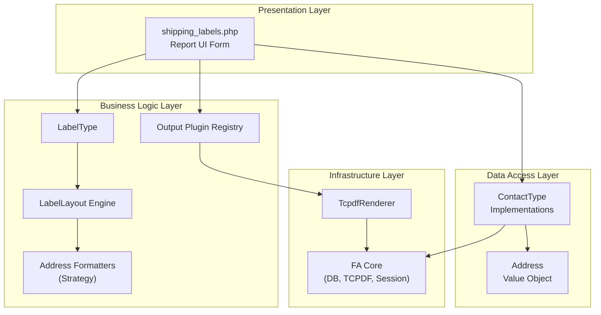
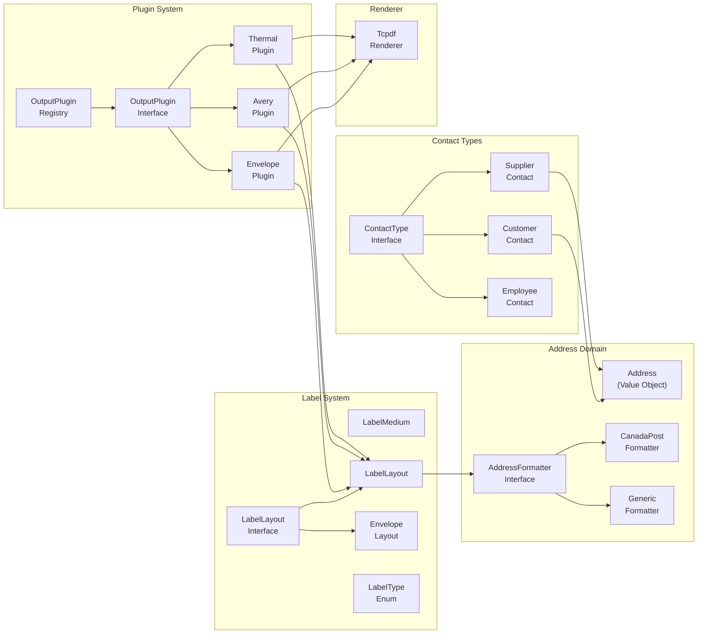
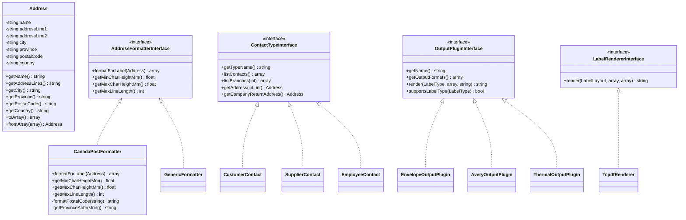
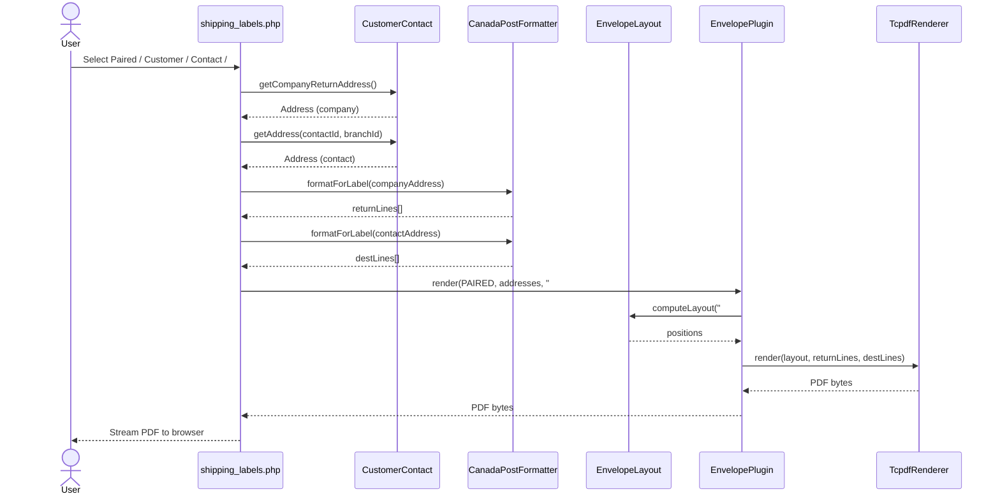

# System Architecture Document

## Document Control

| Field | Value |
|-------|-------|
| Project | FA_Rep_ShippingLabel |
| Version | 1.0 |
| Status | Draft |
| Date | 2026-02-25 |

---

## 1. Architecture Overview

The module follows a **layered architecture** within FrontAccounting's module system, with a **plugin architecture** for output formats and a **Strategy pattern** for address formatting.

### 1.1 Layered Architecture

---

## 2. Component Diagram

---

## 3. Class Diagram (Core)

---

## 4. Sequence Diagram — Generate Paired Envelope Label

---

## 5. Design Patterns Used

| Pattern | Where | Purpose |
|---------|-------|---------|
| Strategy | `AddressFormatterInterface` | Swap carrier formatting without changing clients |
| Plugin | `OutputPluginInterface` | Different output targets without modifying core |
| Factory | `OutputPluginRegistry` | Create/discover plugins dynamically |
| Value Object | `Address` | Immutable, side-effect-free address data |
| Template Method | `LabelLayout` → `EnvelopeLayout` | Base layout with envelope-specific overrides |
| Composition | Contact types compose `Address` | Prefer composition over inheritance |

---

## 6. Technology Stack

| Layer | Technology |
|-------|-----------|
| Language | PHP 7.3+ |
| PDF | TCPDF |
| Database | MySQL/MariaDB via FA DAL |
| Autoloading | PSR-4 via Composer |
| Testing | PHPUnit |
| Module System | FA modules directory + hooks |
