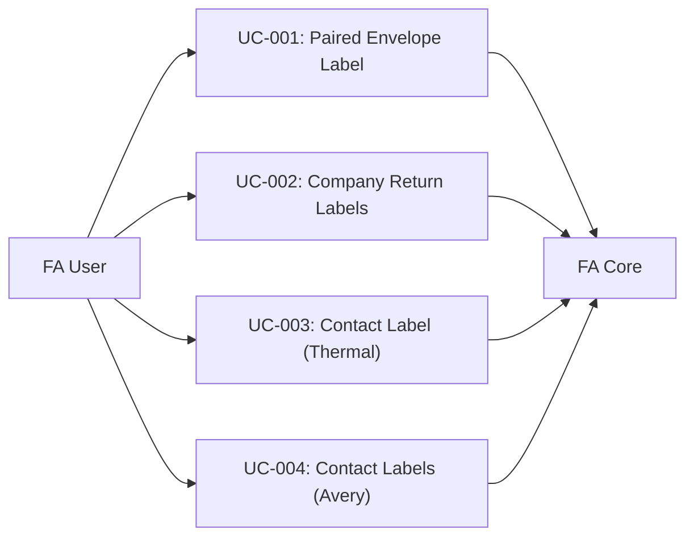

# Use Case Document

## Document Control

| Field | Value |
|-------|-------|
| Project | FA_Rep_ShippingLabel |
| Version | 1.0 |
| Status | Draft |
| Date | 2026-02-25 |

---

## Actors

| Actor | Description |
|-------|-------------|
| FA User | Authenticated FrontAccounting user with report access |
| System | FA_Rep_ShippingLabel module |
| FA Core | FrontAccounting core system (database, PDF, session) |
| Printer | Physical printer (inkjet/laser/thermal) |

---

## UC-001: Generate Paired Envelope Label

**Summary**: User prints a label on an envelope with company return address and contact destination address.

| Field | Value |
|-------|-------|
| Primary Actor | FA User |
| Preconditions | User logged into FA, module installed, ≥1 customer/supplier exists |
| Trigger | User navigates to Reports → Shipping Labels |

**Main Flow**:
1. System displays label generation form
2. User selects **Label Type**: "Paired (Envelope)"
3. User selects **Contact Type**: Customer / Supplier
4. System populates contact list from FA database
5. User selects a **Contact** from the list
6. System populates branch/destination list (if applicable)
7. User selects a **Branch** (or default)
8. User selects **Output Plugin**: "Envelope/Sheet"
9. User selects **Output Format**: e.g., "#10 Envelope"
10. User clicks **Generate**
11. System fetches company address from FA settings
12. System fetches contact address from FA database
13. System formats both addresses per Canada Post T601
14. System computes layout positions for the selected envelope size
15. System generates PDF with return address (top-left) and destination (center)
16. System streams PDF to browser
17. User prints or saves the PDF

**Alternative Flows**:
- **4a**: No contacts found → System displays "No contacts available" message
- **6a**: Contact has no branches → System uses main contact address
- **13a**: International address → System uses GenericFormatter, adds country name

**Postconditions**: PDF file generated matching selected envelope dimensions with correctly positioned address blocks.

---

## UC-002: Generate Company Return Address Labels

**Summary**: User prints a sheet of company return address labels on Avery label stock.

| Field | Value |
|-------|-------|
| Primary Actor | FA User (Office Admin) |
| Preconditions | User logged into FA, company address configured |
| Trigger | User navigates to Reports → Shipping Labels |

**Main Flow**:
1. System displays label generation form
2. User selects **Label Type**: "Company Label"
3. User selects **Output Plugin**: "Avery Label Sheets"
4. User selects **Output Format**: e.g., "Avery 5160 (30/sheet)"
5. User clicks **Generate**
6. System fetches company address from FA settings
7. System formats address per Canada Post T601
8. System generates PDF with label grid filled with company address
9. System streams PDF to browser
10. User prints on Avery 5160 label stock

**Postconditions**: PDF with 30 identical company address labels matching Avery 5160 layout.

---

## UC-003: Generate Contact Address Label (Standalone)

**Summary**: User prints a single contact's address label on thermal printer.

| Field | Value |
|-------|-------|
| Primary Actor | FA User (Shipping Dept) |
| Preconditions | User logged into FA, ≥1 customer/supplier with address |
| Trigger | User navigates to Reports → Shipping Labels |

**Main Flow**:
1. System displays label generation form
2. User selects **Label Type**: "Contact Label"
3. User selects **Contact Type**: Customer
4. System populates contact list
5. User selects a Contact and Branch
6. User selects **Output Plugin**: "Thermal Printer"
7. User selects **Output Format**: e.g., "4×6 Shipping"
8. User clicks **Generate**
9. System fetches contact address
10. System formats address per Canada Post T601
11. System generates PDF sized to 4×6 inches
12. System streams PDF
13. User prints on thermal printer

**Postconditions**: PDF sized 4×6 inches with single formatted address label.

---

## UC-004: Generate Contact Labels on Avery Sheet

**Summary**: User prints contact address labels on an Avery label sheet (e.g., one address per label, filling the sheet).

| Field | Value |
|-------|-------|
| Primary Actor | FA User |
| Preconditions | User logged into FA |
| Trigger | User navigates to Reports → Shipping Labels |

**Main Flow**:
1–5. Same as UC-003 steps 1–5
6. User selects **Output Plugin**: "Avery Label Sheets"
7. User selects **Output Format**: e.g., "Avery 5163 (10/sheet)"
8. User clicks **Generate**
9. System fetches contact address
10. System formats address per carrier rules
11. System generates PDF with label in first position of grid
12. System streams PDF

**Postconditions**: PDF with Avery grid, selected contact's address in first label position.

---

## Use Case Diagram

